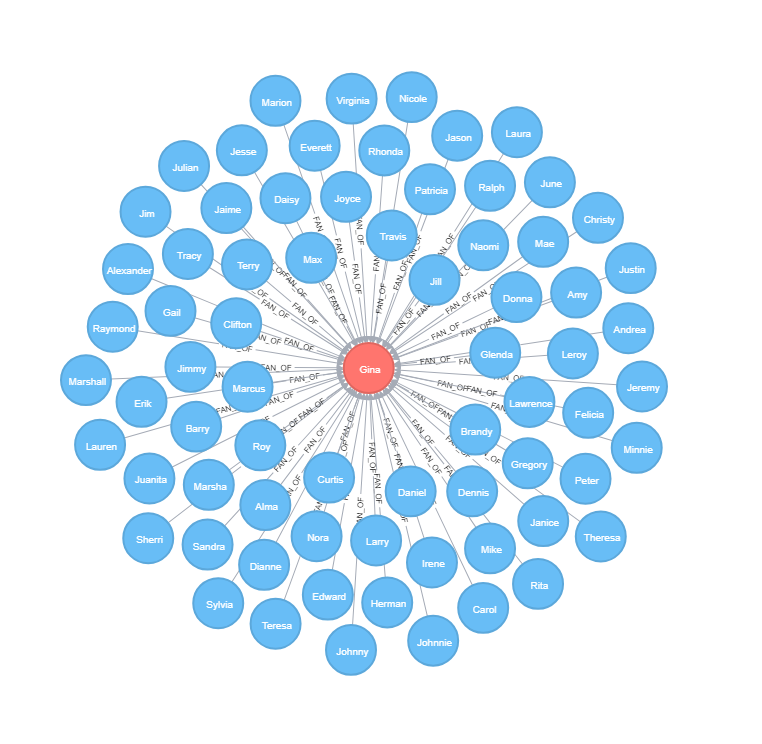
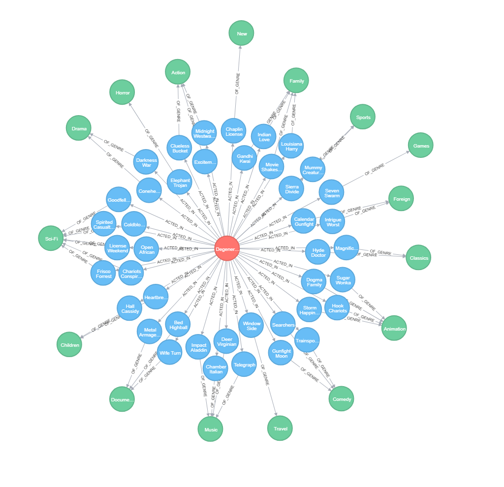

neo4j & postgresql with R
================

R with SQL & NoSQL Databases
----------------

We're going to explore how we can connect R with two different databases from two different types. **PostgreSQL** one of the famous **SQL Relational Databases** and **Neo4j** a **Graph Database**. We're going to use a postgresql sample database (DVDRental) which can be downloaded from <http://www.postgresqltutorial.com/postgresql-sample-database/>. We will use R to query tables from the database and then populate the **Neo4j** Database using its **graph query language (cypher)** then we will see how to connect R to it to query some data.

###### We will need to download and install both databases. PostgreSQL from <https://www.postgresql.org/download/>, and Neo4j from <https://neo4j.com/download-center/#releases>.

#### What Are Graph Databases ?!

###### Simply from Neo4j website:

Very simply, a graph database is a database designed to treat the relationships between data as equally important to the data itself. It is intended to hold data without constricting it to a pre-defined model. Instead, the data is stored like we first draw it out – showing how each individual entity connects with or is related to others.

Now Let's get down to business ...

First We will download the database sample and populate it into the psql server.

``` bash
# download
curl -s "http://www.postgresqltutorial.com/wp-content/uploads/2017/10/dvdrental.zip" -o dvdrental.zip
# unzip
tar -xvf dvdrental.zip
# create the database
createdb -U username dvdrental
# populate it
pg_restore -U username -d dvdrental dvdrental.tar
```

N.B. It will ask you for the password you set when you installed the database.

Now we have a database so we can connect R to it and query data from it.

``` r
### loading the libraries 
suppressMessages(library(RPostgreSQL))
suppressMessages(library(DBI))
## connecting to the database with the credentials
pw <- "password"
drv <- dbDriver("PostgreSQL")
conn <- dbConnect(drv, dbname = "dvdrental", 
                  host = "localhost", port = 5432,
                  password = pw, user = "postgres")

## query some tables
dbListTables(conn)
```

    ##  [1] "staff"         "category"      "film_category" "country"      
    ##  [5] "actor"         "language"      "inventory"     "payment"      
    ##  [9] "rental"        "city"          "store"         "film"         
    ## [13] "address"       "film_actor"    "customer"

``` r
dbGetQuery(conn, "SELECT * FROM language;")
```

    ##   language_id                 name         last_update
    ## 1           1 English              2006-02-15 10:02:19
    ## 2           2 Italian              2006-02-15 10:02:19
    ## 3           3 Japanese             2006-02-15 10:02:19
    ## 4           4 Mandarin             2006-02-15 10:02:19
    ## 5           5 French               2006-02-15 10:02:19
    ## 6           6 German               2006-02-15 10:02:19

``` r
head(dbReadTable(conn, "city"))
```

    ##   city_id               city country_id         last_update
    ## 1       1 A Corua (La Corua)         87 2006-02-15 09:45:25
    ## 2       2               Abha         82 2006-02-15 09:45:25
    ## 3       3          Abu Dhabi        101 2006-02-15 09:45:25
    ## 4       4               Acua         60 2006-02-15 09:45:25
    ## 5       5              Adana         97 2006-02-15 09:45:25
    ## 6       6        Addis Abeba         31 2006-02-15 09:45:25

``` r
## a complicated one  
query <- 
"SELECT customer.customer_id, customer.first_name, customer.last_name, 
inventory.inventory_id, film.film_id, film.title FROM customer  
FULL JOIN rental ON customer.customer_id = rental.customer_id
FULL JOIN inventory ON rental.inventory_id = inventory.inventory_id
FULL JOIN film ON inventory.film_id = film.film_id;"

customer_to_film <- dbGetQuery(conn, query)
head(customer_to_film)
```

    ##   customer_id first_name   last_name inventory_id film_id           title
    ## 1         459      Tommy     Collazo         1525     333    Freaky Pocus
    ## 2         408     Manuel     Murrell         1711     373   Graduate Lord
    ## 3         333     Andrew       Purdy         2452     535   Love Suicides
    ## 4         222    Delores      Hansen         2079     450 Idols Snatchers
    ## 5         549     Nelson Christenson         2792     613   Mystic Truman
    ## 6         269  Cassandra     Walters         3995     870      Swarm Gold

Now we will write the tables we want to disk to later populate Neo4j database with them. We want to see relationships between the movies their categories and their actors and customers so we will need only some tables which are: (category, customer, film\_category, film, actor, language, film\_actor). Then we will query the relationships between these tables. \#\#\#\#\#\# We will write the files to the "import" folder into the neo4j database parent folder to directly read it.

``` r
setwd("path/to/neo4j-community/import")
```

``` r
### getting the files to write it to disk
category <- dbGetQuery(conn, "SELECT * FROM category;")
customer <- dbGetQuery(conn, "SELECT * FROM customer;")
film_category <- dbGetQuery(conn, "SELECT * FROM film_category;")
film <- dbGetQuery(conn, "SELECT film_id, title, language_id, rating, rental_rate FROM film;")
actor <- dbGetQuery(conn, "SELECT * FROM actor;")
language <- dbGetQuery(conn, "SELECT * FROM language;")
film_actor <- dbGetQuery(conn, "SELECT * FROM film_actor;")

write.csv(category, "category.csv")
write.csv(customer, "customer.csv")
write.csv(film, "film.csv")
write.csv(film_category, "film_category.csv")
write.csv(actor, "actor.csv")
write.csv(language, "language.csv")
write.csv(film_actor, "film_actor.csv")

### querying the relationships
query2 <- "SELECT customer.customer_id, 
inventory.inventory_id, film.film_id FROM customer  
FULL JOIN rental ON customer.customer_id = rental.customer_id
FULL JOIN inventory ON rental.inventory_id = inventory.inventory_id
FULL JOIN film ON inventory.film_id = film.film_id;"

customer_film <- dbGetQuery(conn, query2)
head(customer_film)
```

    ##   customer_id inventory_id film_id
    ## 1         459         1525     333
    ## 2         408         1711     373
    ## 3         333         2452     535
    ## 4         222         2079     450
    ## 5         549         2792     613
    ## 6         269         3995     870

``` r
write.csv(customer_film, "customer_film.csv")

## disconnect the database
dbDisconnect(conn)
```

    ## [1] TRUE

Now we have everything ready for Neo4j. So we will run the server from the command line with **"neo4j console"** command and then open it in the browser \*\*<http://localhost:7474/**> to play with its console.

Now we will populate the database and create its nodes and relationships using its cypher language from its console.

``` cypher
// "///" means that the file is in the import folder in the database parent folder

////// Reading Files & Creating the Nodes //////

USING PERIODIC COMMIT
LOAD CSV WITH HEADERS FROM "file:///actor.csv" AS row
CREATE (:Actor {actorID: row.actor_id,
  firstName: row.first_name,
  lastName: row.last_name}); 

USING PERIODIC COMMIT
LOAD CSV WITH HEADERS FROM "file:///customer.csv" AS row
CREATE (:Customer {customerID: row.customer_id,
  firstName: row.first_name,
  lastName: row.last_name}); 

USING PERIODIC COMMIT
LOAD CSV WITH HEADERS FROM "file:///category.csv" AS row
CREATE (:Category {categoryID: row.category_id,
  Name: row.name}); 

USING PERIODIC COMMIT
LOAD CSV WITH HEADERS FROM "file:///film.csv" AS row
CREATE (:Film {filmID: row.film_id,
  Title: row.title}); 

// Create Indexes
CREATE INDEX ON :Film(filmID);
CREATE INDEX ON :Actor(actorID);
CREATE INDEX ON :Category(categoryID);
CREATE INDEX ON :Customer(customerID);

// we use "schema await" to wait until the indexes are online
```

Having the nodes and the indexes we then create the relationships ...

``` cypher
// 1st the RENTED relationship between customer and film
USING PERIODIC COMMIT
LOAD CSV WITH HEADERS FROM "file:///customer_film.csv" AS row
MATCH (c:Customer {customerID: row.customer_id})
MATCH (f:Film {filmID: row.film_id})
MERGE (c)-[:RENTED]->(f);

// 2nd the ACTED_IN relationship between actor and film
USING PERIODIC COMMIT
LOAD CSV WITH HEADERS FROM "file:///film_actor.csv" AS row
MATCH (a:Actor {actorID: row.actor_id})
MATCH (f:Film {filmID: row.film_id})
MERGE (a)-[:ACTED_IN]->(f);

// 3rd the OF_GENRE relationship between film and category
USING PERIODIC COMMIT
LOAD CSV WITH HEADERS FROM "file:///film_category.csv" AS row
MATCH (f:Film {filmID: row.film_id})
MATCH (c:Category {categoryID: row.category_id})
MERGE (f)-[:OF_GENRE]->(c);

// 4th the FAN_OF relationship between customer and actor
// only when customer has rented more than two films for an actor
MATCH (c:Customer)-[r:RENTED]->()<-[]-(a:Actor)
WITH Count(r) AS rentals, a, c
WHERE rentals > 2
MERGE (c)-[f:FAN_OF]->(a);
```

Well. We now have our graph database, it's time to query some data from it and visualize some graphs to see the benefits of using a graph database when dealing with connected data ...

``` cypher
////// QUERYING THE DATABASE //////

// get the total number of fans of Gina
MATCH (g:Actor {firstName: "Gina"})<-[:FAN_OF]-(c:Customer)
RETURN g.firstName +" "+ g.lastName AS actor, 
COUNT(c) AS number_of_fans;
╒════════════════╤════════════════╕
│"actor"         │"number_of_fans"│
╞════════════════╪════════════════╡
│"Gina Degeneres"│71              │
└────────────────┴────────────────┘

// we can also visualize Gina with their fans
MATCH (g:Actor {firstName: "Gina"})<-[:FAN_OF]-(c:Customer)
RETURN g, c;
```



``` cypher
// Visualize Gina with the Movies she acted in along with their categories.
MATCH (g:Actor {firstName: "Gina"})-[a:ACTED_IN]->(f:Film)-[o:OF_GENRE]->(c:Category)
RETURN *;
```



``` cypher
// a complicated query
// each actor and his/her best fan
MATCH (c:Customer)-[r:RENTED]->()<-[]-(a:Actor)
WITH c, a, COUNT(r) AS rentals
RETURN c.firstName + " " + c.lastName AS customer,
MAX(rentals) AS number_of_rentals,
a.firstName + " " + a.lastName AS actor
ORDER BY number_of_rentals DESC LIMIT 10;
╒═════════════════╤═══════════════════╤═════════════════════╕
│"customer"       │"number_of_rentals"│"actor"              │
╞═════════════════╪═══════════════════╪═════════════════════╡
│"Morris Mccarter"│7                  │"Kirsten Akroyd"     │
├─────────────────┼───────────────────┼─────────────────────┤
│"Marsha Douglas" │7                  │"Goldie Brody"       │
├─────────────────┼───────────────────┼─────────────────────┤
│"Louise Jenkins" │6                  │"Mary Keitel"        │
├─────────────────┼───────────────────┼─────────────────────┤
│"Harry Arce"     │6                  │"Gregory Gooding"    │
├─────────────────┼───────────────────┼─────────────────────┤
│"Hazel Warren"   │6                  │"Kirk Jovovich"      │
├─────────────────┼───────────────────┼─────────────────────┤
│"Zachary Hite"   │6                  │"Laurence Bullock"   │
├─────────────────┼───────────────────┼─────────────────────┤
│"Juanita Mason"  │6                  │"Matthew Carrey"     │
├─────────────────┼───────────────────┼─────────────────────┤
│"Suzanne Nichols"│6                  │"Johnny Lollobrigida"│
├─────────────────┼───────────────────┼─────────────────────┤
│"Ramon Choate"   │6                  │"Lisa Monroe"        │
├─────────────────┼───────────────────┼─────────────────────┤
│"Julian Vest"    │6                  │"Sandra Kilmer"      │
└─────────────────┴───────────────────┴─────────────────────┘
```

As we can see, **Neo4j** makes relationships intuitive and clear with pretty visualizations and its **cypher** language is very cool and beautiful. Also we can see that a query in a **SQL** database that can be tens of lines long, can be of only a couple of lines in **Neo4j**. Neo4j has also **grpah algorithms** that can be used to do so many analysis on the data.

Now it's time to connect R to Neo4j.

``` r
### at the time of writing this RNeo4j isn't available for latest versions of R 
### so we install an older version with remotes package

# library(remotes)
# install_version('RNeo4j', '1.6.3')

library(RNeo4j)
graph <- startGraph(url = "http://localhost:7474/db/data/", 
                    username="neo4j", password="password")
```

Now we have a conncetion with the database. Let's make some query to get useful information from the data. e.g., who are the top customers who rented the most and what are the most rented movies ?!

``` r
### get the top customers who rented the most
query <- "MATCH (c:Customer)-[r:RENTED]->()
          RETURN c.firstName + ' ' + c.lastName AS customer,
          COUNT(r) AS total_rentals 
          ORDER BY total_rentals DESC LIMIT 10;"

(topCustomers <- cypher(graph, query))
```

    ##           customer total_rentals
    ## 1     Eleanor Hunt            46
    ## 2        Karl Seal            44
    ## 3       Clara Shaw            42
    ## 4      Marcia Dean            42
    ## 5    Tammy Sanders            41
    ## 6       Sue Peters            40
    ## 7   Rhonda Kennedy            38
    ## 8         Tim Cary            38
    ## 9  Elizabeth Brown            38
    ## 10   Marion Snyder            38

``` r
### get the most rented movie 
query2 <- "MATCH ()-[r:RENTED]->(f:Film)
           RETURN f.Title AS film, 
           COUNT(r) AS total_rentals
           ORDER BY total_rentals DESC LIMIT 10;"

(topFilms <- cypher(graph, query2))
```

    ##                   film total_rentals
    ## 1   Bucket Brotherhood            33
    ## 2       Forward Temple            32
    ## 3  Ridgemont Submarine            32
    ## 4       Grit Clockwork            32
    ## 5        Scalawag Duck            32
    ## 6         Robbers Joon            31
    ## 7       Timberland Sky            31
    ## 8     Rocketeer Mother            31
    ## 9       Juggler Hardly            31
    ## 10        Network Peak            31
    
